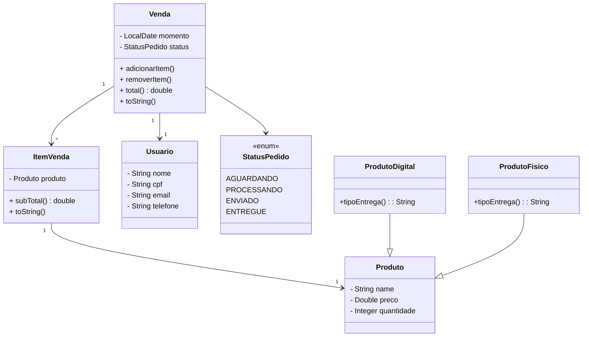

# 🛒 Loja

A **Loja** é uma aplicação Java simples que simula o funcionamento básico de um sistema de vendas.  
Ela utiliza conceitos de orientação a objetos e é ideal para fins didáticos e prática com Java puro (sem frameworks).

## 📦 Funcionalidades

- Cadastro de produtos
- Criação de vendas com itens associados
- Controle de usuários
- Controle de status dos pedidos via enum (`StatusPedido`)
- Cálculo de total de vendas com base nos itens

## 🧱 Estrutura de Entidades

## 💻 Tecnologias Utilizadas

- Java (puro)

## 🚀 Como executar

1. Clone o repositório:

```bash
git clone https://github.com/seu-usuario/loja.git
cd loja
